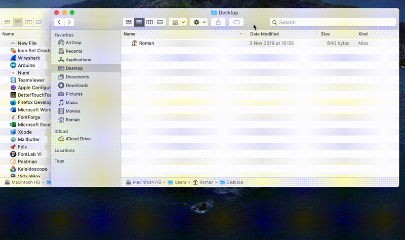
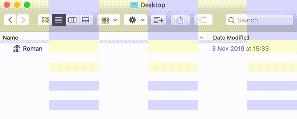

# New File [macOS Finder] 

Ever wanted to simply create a new empty file inside the current directory from Finder just like you are used to in Windows?

This is an AppleScript based application that will create an empty file in the current Finder window. 

It's icon is designed to fit seamlessly into your Finder's toolbar.
Forked and edited to include a better fitting image for Big Sur's dark theme.

## How to Use
Open "New File.applescript" in Script Editor and change the default value of the file name (set in rows 57 and 61 as <DEFAULT FILE NAME>), then go File->Export and export it as an application (maybe put it as executable only). Copy the obtained "New File.app" to your Applications directory or wherever you like. To give it an icon, open the PNG file included in the repository (or one made by yourself) and go Edit->Copy (copy does not work correctly without opening the image), then open app information (cmd+i), click on the default icon and paste the image (cmd+v). Finally, drag and drop the app to the toolbar in Finder to create a shortcut.

  
Starting from Catalina, the app will ask for access to "Finder" and "System Events". Accessibility features also need to be allowed for the script to work correctly.

If you want to use the script in another manner, you can grab it from "New File.applescript"

----
  

